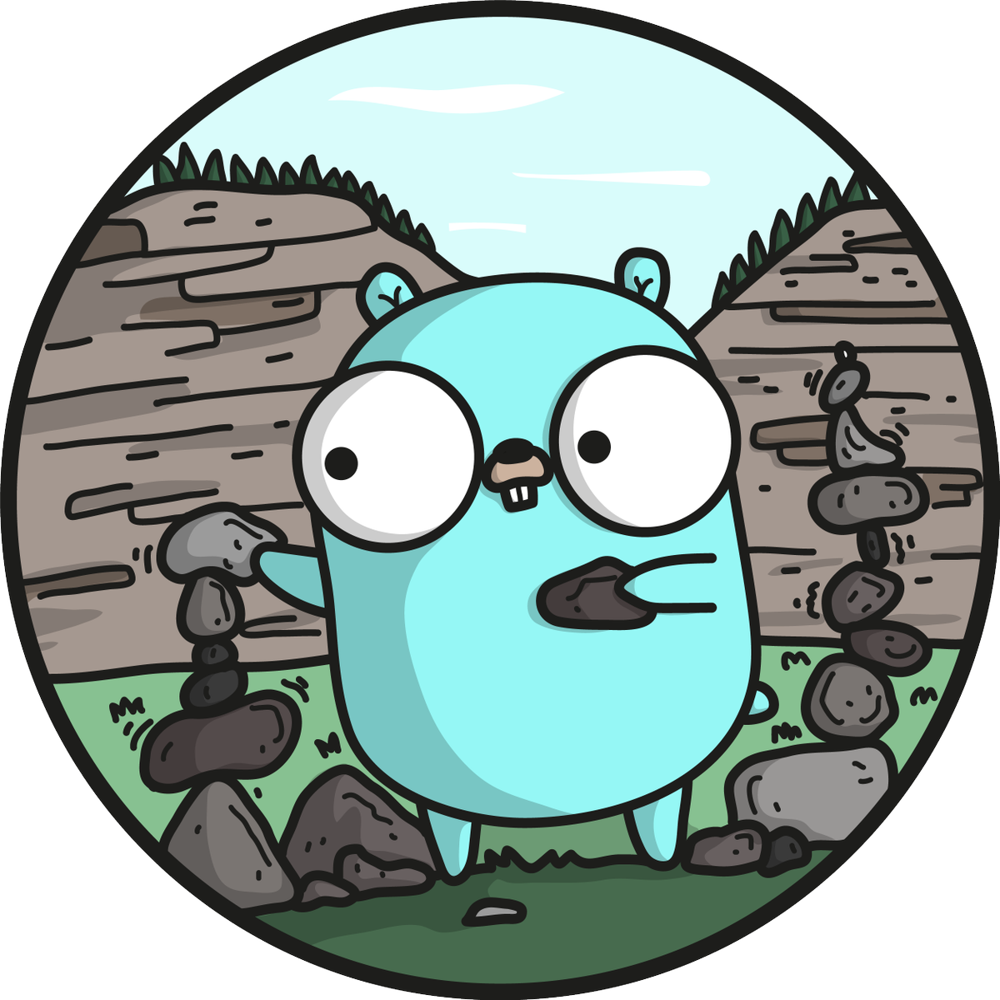
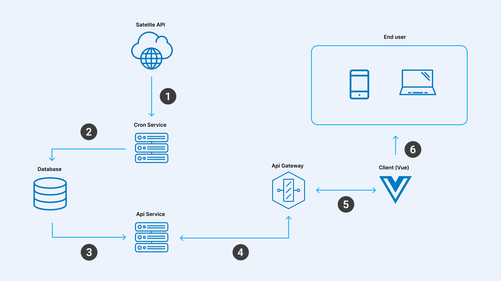
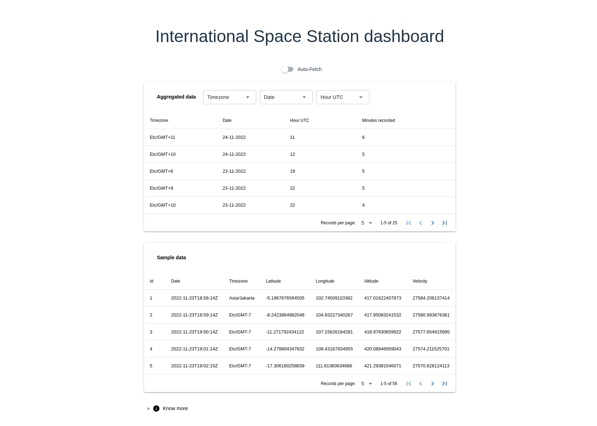

<p align="center">
  
</p>

## International Space Station app

This project gets the current location from the international space station api, and stores it in a database for later use.

The whole purpose is to store the current location, together with the timezone, to be able to check on a specific date at a specific hour, how many minutes were spent by the ISS on a specific Timezone.

- [Application Structure](#application-structure)
- [Application Dataflow](#application-dataflow)
- [Running app locally](#running-app-locally)
- [Application testing](#application-testing)
- [Application usage](#application-usage)
- [Author message](#author-message)

### Application Structure

This application is structured by:

- **Cron Service (Go)** _A service that which purpose is to run cronjobs_
- **Api Service (Go)** _A web server to be consumed by client application_
- **Api Gateway (Go)** _An entry point to the services_
- **Client (Vue)** _An application the end user can interact with_
- **PostgreSQL Database** _Database to store ISS location_

For local development all the applications run in docker containers and it is orchestrated via docker-compose

### Application Dataflow

<p align="center">
  
</p>

1. Data gets pulled every minute from the iss api and it is converted to a schema needed for our research.
2. Once the data is converted, it gets store into the database, this proccess only goes one way and cron service is only responsible to writing data to the DB.
3. The data is pulled by the api service when a GET request is issued, this proccess only goes one way and api service is only responsible for reading the data.
4. The api gateway is accessed via an api gateway that acts as a centralized entry point to other services.
5. The client application communicates with the api via the gateway, and retrieves the needed data to be able to display it to the end user.
6. The end user is able to access the client application via the browser.

### Running app locally

> To be able to run the application you need docker and docker-compose installed. Please refer to the [docs](https://docs.docker.com/compose/install/) to install them before taking any further steps

Clone this repository

```bash
git clone https://github.com/Abeldlp/fullinfo.git
```

Go to the directory

```bash
cd fullinfo
```

Build docker images (cuf of coffee)

```bash
docker-compose build
```

Run all containers in detached mode

```bash
docker-compose up -d
```

At this point you will have five containers running and you can access the client on [http://localhost:3000](http://localhost:3000)

<p align="center">
  
</p>
If you want to access the database container use a client of your liking, and connect to postgres with the following.

- USERNAME `user`
- PASSWORD `password`
- HOST `localhost`
- PORT `5432`
- DATABASE `app-db`

If you want to play with the api, the api gateway is listening on [http://localhost:4444](http://localhost:4444)

To stop the containers you can run the following

```bash
docker-compose down
```

> Optionaly if you have `make` and `build-essentials` installed locally you can make use of the `Makefile`

### Application testing

To run all tests at once you can make use of the Makefile. You will need `make` and `build-essentials` installed locally. Refer to your OS/Distro installation docs.
Before running any tests don't forget to stop all the containers, since client e2e testing is using the same port mapping to serve with mock and run tests.

```bash
make test
```

The above command will run api-service tests, cron-service tests, client unit tests and client e2e tests.

To run them individually you can run the following:

**Api Service**

```bash
cd api-service && go test ./test
```

**Cron Service**

```bash
cd schedule-service && go test ./test
```

**Client (unit)**

```bash
cd client && npm run test:unit:ci
```

**Client (e2e)**

```bash
cd client && npm run test:e2e:ci
```

For the client's e2e testing you can also run them in preview mode, so you can visualize what the tests are doing on a Chromium, Electron or Firefox browser.
You can run them with the following command:

```bash
cd client && npm run test:e2e
```

In case of client project showcase, it is also possible to run the project in mocking mode, which will mock api calls and use static data. The project will be served on [http://localhost:3000](http://localhost:3000)
You can serve the project with mock locally with the following command:

```bash
cd client && npm run dev-mock
```

### Application usage

The client application consists on:

- Autofetch button.
- Aggregated Datatable
- Sample Datatable
- Informational tree

**Autofetch button**

This button allows the user to fetch data automatically every minute so page reload is not required to fetch data.

**Aggregated Datatable**

Datatable containing the data aggregated. You are able to paginate, sort and filter using the selectors.

**Sample Datatable**

Datatable containing all the data stored in the database. You are able to paginate and sort.

**Informational Tree**

You can always check the explanation of the page parts in case you get lost.

### Author message

This application is simple to use and straight to the point. If you wish to develop locally remember that you will need Golang and Node installed.

If any questions come your way don't hesitate to drop an email to <abel45991690@gmail.com>

<p align="center">
  
</p>
